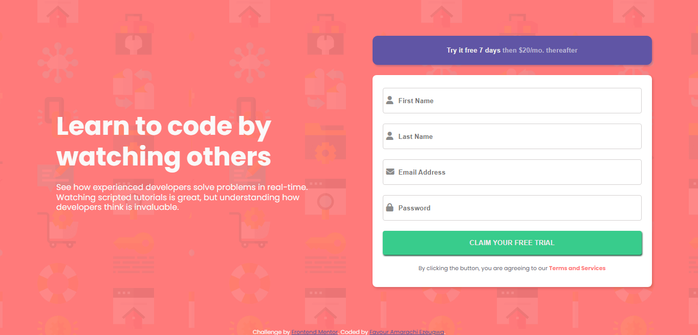
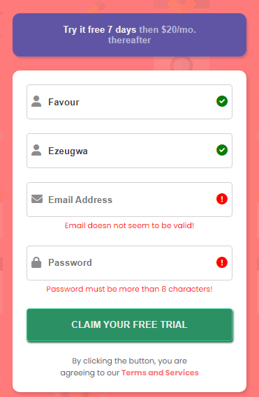

# Intro component with sign up form

> This is a web page where users can enter the information required to access the learn to code by watching others website's services. The information collected is signup forms requires a First name, Last name, an email address, username, and a password.

## Overview

### Screenshot




### Links

- Solution URL: [solution URL](https://github.com/Favourezeugwa/Sign-up-form)
- Live Demo URL: [see live demo](https://favourezeugwa.github.io/Sign-up-form/)

## My process

### Built with

- Semantic HTML5 markup
- CSS custom properties
- Flexbox
- Mobile-first workflow
- Javascript

### Proud of

some code snippets, see below:

```html
<button type="button" class="tryIt-btn">
  <b>Try it free 7 days</b> then $20/mo. thereafter
</button>
```

```css
.proud-of-this-css {
  @keyframes myAnimation {
    0% {
      transform: translateX(-100px);
    }
  }
}
```

```js
if (emailValue.match(RegExp)) {
  errorMessage[index].innerHTML = "🎉";
}
```

## Author

👤 **Favour Amarachi Ezeugwa**

- GitHub: [@Favourezeugwa](https://github.com/Favourezeugwa)
- LinkedIn: [Favour Amarachi Ezeugwa](https://www.linkedin.com/in/favour-amarachi-ezeugwa-a5bb31149/)
- Twitter - [@Favour_ezeugwa](https://twitter.com/Favour_ezeugwa)
- Frontend Mentor - [@favourezeugwa](https://www.frontendmentor.io/profile/Favourezeugwa)

## Show your support

Give a ⭐️ if you like this project!

## Acknowledgments

- Frontend mentor
